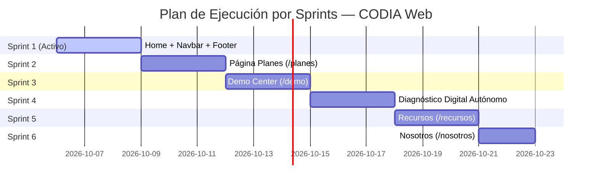

# CODIA UX BLUEPRINT
## FASE 1 — UX & Information Architecture Refactor

> **Documento Oficial de Arquitectura de Experiencia, Contenido y Frontend**  
> **Versión:** 3.0 (Congelada como Especificación Funcional Oficial)  
> **Estado:** Aprobado — En Ejecución (Sprint 1 Activo)  
> **Proyecto:** CODIA Software  
> **Objetivo:** Reestructuración comercial del sitio web bajo un embudo de alta conversión sin alterar la identidad visual.

---

## 1. Contexto y Enfoque de Embudo Comercial

El Home de CODIA deja de ser un resumen corporativo para convertirse en una **Landing Comercial de Alta Conversión**. Todo bloque que no empuje al usuario a tomar una decisión ha sido eliminado.

### Recorrido del Embudo Comercial (Home)
$$\text{Hero (15s)} \longrightarrow \text{Problemas} \longrightarrow \text{Soluciones} \longrightarrow \text{Demo} \longrightarrow \text{Planes} \longrightarrow \text{Diagnóstico Digital} \longrightarrow \text{Casos} \longrightarrow \text{FAQ} \longrightarrow \text{Agenda}$$

---

## 2. Reglas y Restricciones Inmutables

### 2.1 Identidad Visual (100% Preservada)
- **NO MODIFICAR:** Logotipo, paleta cromática (`#091020`, `#0B2551`, `#A4F4FD`, `#00d2ff`, acentos esmeralda y púrpura), fondo con ruido SVG dinámico (`#c3-noise`), estilo `liquid-glass`, tipografías y animaciones de entrada.

### 2.2 Regla de los 2 Clics (Obligatoria)
| Acción Clave | Clics Permitidos | Ruta / Acceso Directo |
| :--- | :---: | :--- |
| **Ver Demo** | ≤ 2 | Menú (`/demo`) o Hero CTA |
| **Ver Planes** | ≤ 2 | Menú (`/planes`) o Bloque Planes |
| **Evaluar Negocio** | ≤ 2 | Botón destacado Navbar o Hero CTA |
| **Contactar / Agendar** | ≤ 2 | Botón flotante / Footer / Agenda |

### 2.3 Unificación de los 3 CTAs Oficiales
1. **`Evaluar mi negocio`** ➔ Diagnóstico Digital interactivo (Calificación de Lead).
2. **`Ver una demostración`** ➔ Acceso al Demo Center y prueba de producto (Prueba / Confianza).
3. **`Agendar una reunión`** ➔ Cierre directo con el equipo comercial (Conversión / Venta).

---

## 3. Separación Clara: Soluciones vs. Sectores

| Dimensión | Qué Responde | Catálogo |
| :--- | :--- | :--- |
| **Soluciones** | *¿Qué tipo de herramienta o sistema construimos?* | • Sitios Web & E-Commerce • Software a Medida • Punto de Venta (POS) • Automatización de Procesos • Consultoría Digital |
| **Sectores** | *¿Para qué industria está adaptada la solución?* | • **🟢 Alimenticio (Disponible hoy):** Cafeterías, restaurantes, dark kitchens • **🟡 Ópticas (Próximamente):** Graduaciones y citas • **🟡 Retail (Próximamente):** Comercios locales y boutiques |

---

## 4. Biblioteca de Evidencias (Central de Recursos Visuales)

Estructura centralizada de assets reutilizables que alimentan el Home, Demo Center, Planes y Casos:
- **Videos del MVP:** Grabaciones de 30-60s de toma de pedidos, comandas y stock en vivo.
- **Capturas Reales de Interfaces:** Vistas móviles y dashboards de proyectos entregados (FestEasy, Kyros, Tienda Online, POS Tablet).
- **Métricas de Rendimiento:** Pruebas de velocidad de carga, tiempos de despacho y ahorro de horas operativas.
- **Diagramas y Flujos:** Esquemas interactivos de arquitectura de software y sincronización WhatsApp/Sheets.

---

## 5. Content Inventory (Inventario de Contenido y Fuentes)

| Bloque / Sección | Estado | Fuente Oficial | Responsable / Archivo |
| :--- | :--- | :--- | :--- |
| **01 Hero** | Reescribir | Blueprint v3.0 (Valor en 15s) | `src/components/Hero.tsx` |
| **02 Problemas** | Nuevo | Feedback Consultora de Marketing | `src/components/ProblemsSection.tsx` |
| **03 Soluciones** | Refactorizar | Catálogo de Soluciones por Resultados | `src/components/SolutionsGrid.tsx` |
| **04 Demo** | Nuevo | MVP Cafetería (`https://mvp-cafeteria-tau.vercel.app/`) | `src/components/DemoCenterSection.tsx` |
| **05 Planes** | Nuevo | Esquema Start / Business / Enterprise | `src/components/PricingSummary.tsx` & `/planes` |
| **06 Diagnóstico Digital** | Nuevo | Flujo de 6 pasos de diagnóstico de negocio | `src/components/DigitalDiagnosis.tsx` |
| **07 Casos de Éxito** | Reorganizar | Portafolios y Proyectos CODIA (FestEasy, Kyros) | `src/components/TrustSection.tsx` |
| **08 FAQ** | Nuevo | 5 Objeciones clave de contratación | `src/components/FAQSection.tsx` |
| **09 Agenda** | Nuevo | Agendamiento y Cierre Estratégico | `src/components/FinalCTA.tsx` |
| **Navbar & Footer** | Actualizar | Menú simplificado + 3 CTAs + Links legales | `Navbar.tsx` & `Footer.tsx` |

---

## 6. Plan de Implementación por Sprints

- **Sprint 1 (Completado):**
  - Refactorización integral del Home como Landing Comercial de 9 bloques.
  - Actualización del `Navbar` (Menú limpio con botón de Diagnóstico Digital sticky).
  - Actualización del `Footer` (Accesos rápidos a Planes, WhatsApp y Legal).
- **Sprint 2 (Completado — Product & Pricing Experience):**
  - Página dedicada `/planes` con Hero de valor, desglose de 3 niveles, comparativa exhaustiva de módulos, casos de uso por industria (Alimentos, Retail, Ópticas, Servicios), ROI estimado y FAQ de contratación.
  - Refactorización del reproductor de video de cafetería (responsivo 16:9 con controles interactivos de audio y modal calificado).
  - Transparencia en Sectores: 🟢 `Disponible hoy` para Alimentos y 🟡 `Próximamente` para Retail, Ópticas y Servicios con tarjetas de consultoría personalizada.
- **Sprint 3 (Completado — Soluciones + Catálogo Comercial):**
  - Limpieza de navegación: Eliminación temporal de `Recursos` del Navbar y Footer.
  - Catálogo centralizado de soluciones (`src/data/solutions.ts`, `industries.ts`, `process.ts`, `caseStudies.ts`, `faqs.ts`).
  - Suite de componentes reutilizables: `SolutionCard`, `ProblemCard`, `IndustryBadge`, `BenefitCard`, `ProcessTimeline`, `CaseStudyCard`, `CTASection`.
  - Nueva página dedicada `/soluciones` con 8 bloques comerciales orientados a conversión.
- **Sprint 4 (Siguiente):** Diagnóstico Digital Autónomo & Evaluación interactiva (`/evaluacion`).
- **Sprint 5:** Centro de Demostración Dedicado (`/demo`) con video showcases y agenda directa.
- **Sprint 6:** Refactorización de Nosotros & Metodología (`/nosotros`).

---

## 7. Decisiones Confirmadas (Congeladas)

- ✅ **Home como Landing Comercial Pura:** Flujo enfocado 100% en conversión.
- ✅ **Identidad Visual Intacta:** Glassmorphism, paleta neón/azul profundo, ruido dinámico SVG.
- ✅ **Regla de los 2 Clics:** Máximo 2 interacciones para agendar, cotizar o evaluar.
- ✅ **3 CTAs Oficiales:** `Evaluar mi negocio`, `Agendar una demostración`, `Solicitar una propuesta`.
- ✅ **Sustitución de "Demo" suelta:** Se utiliza de forma consistente `Demostración`, `Demostración guiada`, `Agendar una demostración` o `Conoce el sistema en acción`.
- ✅ **Navegación Oficial Limpia:** `Inicio | Soluciones | Planes | Demostración | Nosotros | [ Evaluar mi negocio ]`.
- ✅ **Transparencia en Sectores:** 🟢 `Disponible hoy` exclusivo para Alimentos (Cafeterías & Restaurantes); 🟡 `Próximamente` para Retail, Ópticas y Servicios con tarjetas de consultoría personalizada y lista de espera.
- ✅ **Diagnóstico Digital** como término formal de cara al usuario.
- ✅ **Eliminación del MVP Abierto:** Sustituido por Demostración Personalizada Guiada (20 min).
- ✅ **Catálogo Centralizado:** Toda la data sale de fuentes únicas en `src/data/`.
- ✅ **Desarrollo por Sprints incrementales con revisión continua.**
